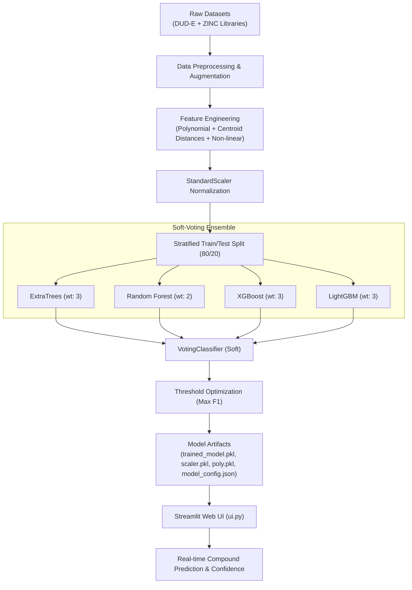

# 🐶 Canine Influenza – Molecular Activity Predictor

[](https://www.python.org/)
[](https://streamlit.io/)
[](https://scikit-learn.org/)
[](https://xgboost.readthedocs.io/)
[](https://lightgbm.readthedocs.io/)

An end-to-end Machine Learning pipeline and interactive web application designed to screen and predict the biological activity (**Active** vs. **Inactive**) of small chemical molecules against **Canine Influenza Virus (CIV)** drug targets (such as viral Neuraminidase).

---

## 📌 Project Overview

Canine Influenza is a contagious respiratory infection in dogs caused by specific Type A influenza viruses (such as H3N8 and H3N2). Accelerated drug discovery and antiviral screening require evaluating large chemical libraries to identify potent inhibitors.

This project implements:
- **Physicochemical Feature Engineering**: Extracts higher-order geometric, polynomial, and active-centroid distance metrics from fundamental molecular properties (Molecular Weight, LogP, Charge).
- **Balanced Data Augmentation**: Merges high-confidence active ligands (DUD-E), decoy sets, and drug-like compounds (ZINC database) with active-space Gaussian perturbation.
- **Ensemble Learning**: Combines **ExtraTrees**, **Random Forest**, **XGBoost**, and **LightGBM** inside a soft-voting classifier with dynamic decision-threshold optimization.
- **Interactive Web Interface**: A **Streamlit** dashboard enabling researchers and chemists to input candidate compounds, predict bioactivity in real time, view confidence scores, and examine model metrics.

---

## 🚀 Key Features

- **High-Performance Soft-Voting Ensemble**:
  Blends tree-based bagging and gradient boosting models:
  - ExtraTrees Classifier (Weight: 3)
  - Random Forest Classifier (Weight: 2)
  - XGBoost Classifier (Weight: 3)
  - LightGBM Classifier (Weight: 3)
- **Advanced 18-Dimensional Feature Space**:
  - Raw descriptors: Molecular Weight ($MW$), Partition Coefficient ($LogP$), Formal Net Charge ($Q$).
  - Degree-2 Polynomial interaction terms ($MW^2$, $LogP^2$, $MW \times LogP$).
  - Target centroid deviations ($d_{MW} = MW - \mu_{active}$, $d_{LogP} = LogP - \mu_{active}$).
  - Active-space Gaussian radial density: $\exp\left(-\frac{1}{2}\left[\left(\frac{d_{MW}}{\sigma_{MW}}\right)^2 + \left(\frac{d_{LogP}}{\sigma_{LogP}}\right)^2\right]\right)$.
  - Non-linear transforms: $|Q|$, $\frac{MW}{|LogP| + 10}$, $\log(1 + MW)$, $\log(1 + |LogP|)$, $\sqrt{MW}$.
- **Decision Threshold Optimization**:
  Scans decision boundaries to maximize the $F_1$-score, mitigating false positives while preserving sensitivity.
- **Intuitive Web UI**:
  Input molecular properties via sliders/inputs to instantly view class predictions and model confidence.
- **Model Explainability**:
  Built-in support for SHAP summary and feature importance visualization.

---

## 📊 Model Performance

Evaluated on stratified test sets with optimized decision thresholds ($t = 0.60$):

| Metric | Score |
| :--- | :--- |
| **Accuracy** | **97.72%** |
| **Precision** | **97.31%** |
| **Recall** | **96.72%** |
| **F1-Score** | **97.01%** |

*(Reference values from `model_config.json`)*

---

## 🏗️ Architecture & Pipeline Flow



---

## 📁 Repository Structure

```plaintext
├── ml_pipeline.py                  # End-to-end model training, feature generation, & export
├── ui.py                           # Streamlit web application
├── model_config.json               # Exported threshold, centroid stats, & evaluation metrics
├── scaler.pkl                      # Fitted StandardScaler artifact
├── poly.pkl                        # Fitted PolynomialFeatures artifact
├── trained_model.pkl               # Serialized Soft VotingClassifier (Git LFS / local)
├── trained_models.pkl              # Auxiliary baseline models
│
├── dude_all (1).csv                # Benchmark DUD-E dataset (active & decoy compounds)
├── 250k_rndm_zinc_drugs_clean_3.csv# ZINC database drug-like compounds
├── active_cases_sample.csv         # Validated antiviral compound reference examples
│
├── feature_importance.png          # Feature importance plot
├── shap_summary.png                # SHAP explanation beeswarm plot
│
├── check_setup.py                  # Environment verification script
├── diag.py                         # Diagnostic probability & threshold sweep
├── diag_output.txt                 # Diagnostic output logs
├── verify_metrics.py               # Model evaluation & metrics verifier
├── verification_report.txt         # Baseline model comparison report
├── batch_predictions.json          # Example batch inference results
├── requirements.txt                 # Python dependencies
└── README.md                       # Project documentation
```

---

## ⚙️ Installation & Setup

### 1. Prerequisites
- Python 3.10 or higher
- Git

### 2. Clone the Repository
```bash
git clone https://github.com/venkatateja-gif/Prediction-of-canine-influenza.git
cd Prediction-of-canine-influenza
```

### 3. Create & Activate a Virtual Environment
```bash
# Windows (PowerShell)
python -m venv .venv
.\.venv\Scripts\Activate.ps1

# Linux / macOS
python3 -m venv .venv
source .venv/bin/activate
```

### 4. Install Dependencies
```bash
pip install -r requirements.txt
```

---

## 💻 Usage

### 🧪 Training the Machine Learning Pipeline
To retrain the ensemble model and regenerate the serialized artifacts:
```bash
python ml_pipeline.py
```
This will:
1. Load and augment DUD-E and ZINC datasets.
2. Generate all 18 engineered features.
3. Fit the soft-voting ensemble across 4 algorithms.
4. Scan thresholds to identify the optimal $F_1$-score.
5. Save `trained_model.pkl`, `scaler.pkl`, `poly.pkl`, and `model_config.json`.

### 🖥️ Launching the Web Interface
Run the Streamlit application:
```bash
streamlit run ui.py
```
Open your browser and navigate to:
```
http://localhost:8501
```

---

## 🔬 Molecular Input Guide

When testing compound activity in the application, refer to typical physicochemical ranges:

| Property | Feature Name | Typical Active Range | Typical Inactive Range |
| :--- | :--- | :--- | :--- |
| **Molecular Weight** | `mw` | ~280 – 430 g/mol ($\mu \approx 337.6$) | Diverse (< 200 or > 500) |
| **LogP** | `logP` | ~ -3.5 to +2.5 ($\mu \approx 0.39$) | Highly hydrophobic (> 4.0) or hydrophilic |
| **Formal Charge** | `charge` | -2 to +1 ($\mu \approx 0$) | Highly charged |

*Example Active Reference (Oseltamivir/Zanamivir class analogs)*:
- **MW**: `337.6`
- **LogP**: `0.39`
- **Charge**: `0`
- **Expected Prediction**: **Active ✅** (~95%+ confidence)

---

## 📈 Model Explainability

The pipeline includes interpretability analysis:
- **Feature Importance**: Evaluates the relative importance of engineered terms (such as active centroid Gaussian density and polynomial interactions).
- **SHAP Summary**: Shows positive and negative attribution values for molecular weight, charge, and lipophilicity bounds.

---

## 📜 License

This project is open-source and available under the [MIT License](LICENSE).

---

## 👤 Author

Developed by [venkatateja-gif](https://github.com/venkatateja-gif). Contributions and feedback are welcome!
